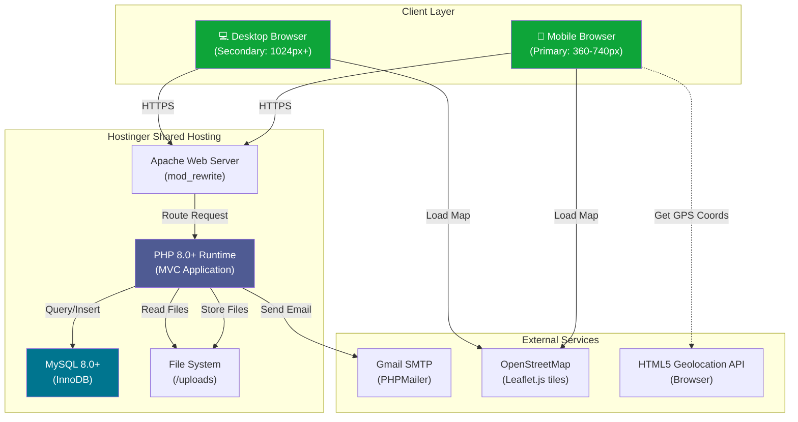

# OJT Route Fullstack Architecture Document

**Version:** 1.0  
**Date:** October 5, 2025  
**Project:** OJT Route - Student OJT Tracking & Management System  
**Team:** Pia Fernandez (Project Leader), Manuel A. Colorado (Developer), Kyla Rolan (Member)  
**Institution:** Carlos Hilado Memorial State University  
**Advisor:** Jayrelle Sy

---

## Table of Contents

1. [Introduction](#1-introduction)
2. [High Level Architecture](#2-high-level-architecture)
3. [Tech Stack](#3-tech-stack)
4. [Data Models](#4-data-models)
5. [Components](#5-components)
6. [External APIs](#6-external-apis)
7. [Core Workflows](#7-core-workflows)
8. [Database Schema](#8-database-schema)
9. [Frontend Architecture](#9-frontend-architecture)
10. [Backend Architecture](#10-backend-architecture)
11. [Development Workflow](#11-development-workflow)
12. [Deployment Architecture](#12-deployment-architecture)
13. [Testing Strategy](#13-testing-strategy)
14. [Coding Standards](#14-coding-standards)
15. [Error Handling Strategy](#15-error-handling-strategy)
16. [Monitoring and Observability](#16-monitoring-and-observability)
17. [Architecture Summary](#17-architecture-summary)

---

## 1. Introduction

This document outlines the complete fullstack architecture for **OJT Route**, a web-based student OJT tracking and management system for Carlos Hilado Memorial State University (CHMSU). It serves as the single source of truth for development, ensuring consistency across the entire technology stack.

OJT Route employs a **traditional monolithic PHP architecture** with server-side rendering, designed for rapid development by a small team (3 students) within a 12-week capstone timeline. This architecture prioritizes simplicity, maintainability, and cost-effectiveness while delivering the core features needed to digitize CHMSU's OJT monitoring process.

**Key Architectural Decisions:**
- **Monolithic MVC Pattern:** Single codebase with PHP backend handling both business logic and HTML rendering
- **Server-Side Rendering:** Traditional multi-page application (not SPA) for better SEO and simpler deployment
- **Shared Hosting Deployment:** Optimized for Hostinger's shared hosting environment (no Docker, no Node.js server)
- **Mobile-First Responsive Design:** Bootstrap 5.3+ ensures excellent mobile experience for students in the field
- **Progressive Enhancement:** Core functionality works without JavaScript; JS enhances UX

### 1.1 Starter Template or Existing Project

**N/A - Greenfield Project**

OJT Route is a **custom-built capstone project** starting from scratch. No existing starter templates or frameworks are being used beyond standard libraries (Bootstrap for UI, PHPMailer for emails, Leaflet.js for maps).

**Rationale:** The team opted for vanilla PHP (no Laravel/Symfony) to:
1. Maximize learning about core web development concepts
2. Minimize framework overhead and complexity
3. Ensure compatibility with Hostinger's shared hosting environment
4. Meet capstone requirements for demonstrable technical knowledge

### 1.2 Change Log

| Date | Version | Description | Author |
|------|---------|-------------|--------|
| Oct 5, 2025 | 1.0 | Initial architecture document creation | Winston (Architect) + Manuel Colorado |

---

## 2. High Level Architecture

### 2.1 Technical Summary

**OJT Route** is a **traditional monolithic web application** built with **PHP 8.0+** and **MySQL 8.0+**, deployed on **Hostinger shared hosting**. The system follows the **Model-View-Controller (MVC) pattern** with server-side rendering, delivering HTML pages directly from PHP without a separate frontend framework.

The architecture is designed for **simplicity and rapid development**, leveraging proven technologies that require minimal infrastructure. Students access the system via mobile browsers (primary interface), where they use HTML5 Geolocation API and camera access for GPS-verified attendance with photo capture. Bootstrap 5.3+ provides responsive UI components that adapt seamlessly from 360px mobile screens to desktop displays.

**Key integration points** include PHPMailer for SMTP email notifications (Gmail), Leaflet.js for interactive map interfaces (OpenStreetMap tiles), and the HTML5 Geolocation API for workplace verification using the Haversine Formula (40m radius enforcement). All user data, documents, and photos are stored on the server filesystem, with metadata in MySQL and file paths in the database.

The system achieves PRD goals through **role-based access control** (student/instructor/admin dashboards), **compliance gates** (document approval blocks attendance), **pattern detection** (identifying at-risk students), and **bulk operations** (CSV registration, batch approvals)—all orchestrated through PHP business logic and database triggers.

### 2.2 Platform and Infrastructure Choice

**Platform:** Hostinger Shared Hosting (Premium or Business plan)  
**Key Services:**
- **Web Server:** Apache with mod_rewrite (URL routing)
- **PHP:** Version 8.0+ (object-oriented features, type declarations)
- **Database:** MySQL 8.0+ (InnoDB engine, foreign keys)
- **Email:** SMTP relay via Gmail (not Hostinger SMTP due to reliability)
- **SSL:** Free Let's Encrypt certificate (auto-renewal)
- **Storage:** 100GB SSD (ample for documents/photos)
- **Control Panel:** cPanel with phpMyAdmin, FTP, file manager

**Deployment Host and Regions:** Hostinger data center in Singapore (closest to Philippines for optimal latency)

### 2.3 Repository Structure

**Structure:** Monorepo (single Git repository)  
**Monorepo Tool:** N/A (simple folder structure, no Nx/Turborepo needed)  
**Package Organization:** Traditional PHP project structure with separation of concerns

### 2.4 High Level Architecture Diagram



### 2.5 Architectural Patterns

- **Model-View-Controller (MVC)** - Server-side MVC separating data models, business logic, and presentation templates
- **Repository Pattern** - Abstract database access through Repository classes
- **Service Layer** - Reusable business logic encapsulated in Service classes
- **Front Controller Pattern** - Single entry point routes all requests to appropriate controllers
- **Active Record (Simplified)** - Model classes map to database tables with CRUD methods
- **Template View Pattern** - PHP templates render HTML with embedded PHP for dynamic content
- **Session-Based Authentication** - PHP sessions store user state; cookies for "remember me"
- **Role-Based Access Control (RBAC)** - Middleware checks user role before allowing access to pages/features
- **Queue-Based Email Processing** - Emails stored in database queue, processed by cron job asynchronously
- **Compliance Gate Pattern** - Middleware checks prerequisites before allowing feature access

---

## 3. Tech Stack

| Category | Technology | Version | Purpose | Rationale |
|----------|-----------|---------|---------|-----------|
| **Backend Language** | PHP | 8.0+ | Server-side logic, HTML rendering, business rules | Industry-standard for web apps; excellent Hostinger support; team familiarity; OOP features |
| **Backend Framework** | None (Vanilla PHP) | N/A | MVC structure without framework overhead | Demonstrates core PHP knowledge for capstone; no framework learning curve; full control over architecture |
| **API Style** | None (Server-Side Rendering) | N/A | PHP directly renders HTML pages | Traditional multi-page app; simpler than REST API; no CORS issues; better SEO |
| **Frontend Language** | JavaScript (ES6+) | ES2015+ | Client-side interactivity, geolocation, camera access | Native browser support; no transpilation needed; async/await for API calls; modern syntax |
| **Frontend Framework** | None (Vanilla JS) | N/A | DOM manipulation, event handling | Lightweight; no build pipeline; demonstrates JS fundamentals; Bootstrap handles most UI needs |
| **UI Component Library** | Bootstrap | 5.3+ | Responsive grid, pre-built components, utilities | Mobile-first by default; extensive component library; low learning curve; excellent documentation |
| **CSS Framework** | Bootstrap CSS | 5.3+ | Styling, responsive layouts | Integrated with Bootstrap; utility classes for rapid styling; CHMSU green customization via CSS variables |
| **State Management** | PHP Sessions | Native | User authentication, role-based access | Built-in PHP; secure with HTTPS + HttpOnly cookies; no client-side state needed for SSR |
| **Database** | MySQL | 8.0+ | Relational data storage (users, attendance, documents) | Mature RDBMS; excellent for structured data; foreign keys for referential integrity; Hostinger native support |
| **Cache** | None (MySQL Query Cache) | Native | Basic query result caching | MySQL built-in; sufficient for 500-user scale; no Redis needed for capstone scope |
| **File Storage** | Server Filesystem | Native | Store uploads (documents, photos, profile pictures) | Simple; no S3/cloud cost; Hostinger 100GB SSD; file paths stored in MySQL |
| **Authentication** | PHP Native Sessions + password_hash() | PHP 8.0+ | Login, session management, password security | Bcrypt hashing (password_hash); session regeneration prevents fixation; 30-min timeout |
| **Authorization** | Custom RBAC Middleware | Custom | Role-based access control (student/instructor/admin) | Enforce PRD security requirements; check role on every page load; gate pattern for compliance |
| **Email Service** | PHPMailer | 6.8+ | SMTP email sending via Gmail | Industry-standard PHP library; Gmail SMTP (smtp.gmail.com:587); retry logic for failed sends |
| **Map Library** | Leaflet.js | 1.9+ | Interactive maps for workplace location setup | Free; no API key; excellent mobile support; 40m radius circle visualization |
| **Map Tiles** | OpenStreetMap | Latest | Map imagery for Leaflet | Free; unlimited requests; open-source; adequate accuracy for Philippines |
| **Geolocation** | HTML5 Geolocation API | Native | Get GPS coordinates for attendance verification | Browser native; no library needed; accuracy metadata included; permission-based |
| **Image Processing** | GD Library | PHP 8.0+ | Compress photos (80% quality), resize profile pics (300x300) | PHP built-in; no external dependency; supports JPEG/PNG; sufficient for basic compression |
| **Frontend Testing** | Manual Testing | N/A | UI/UX testing, cross-browser compatibility | Realistic for 12-week capstone; team manually tests all workflows; UAT with 5-10 users |
| **Backend Testing** | PHPUnit | 9.6+ | Unit tests for critical functions (Haversine, password hashing) | PHP standard testing framework; 30-40% coverage target for high-risk code only |
| **E2E Testing** | Manual Testing | N/A | End-to-end workflow testing | Team manually tests complete user journeys; more practical than Cypress/Playwright for capstone |
| **Package Manager** | Composer | 2.5+ | Manage PHP dependencies (PHPMailer, PHPUnit) | PHP standard; autoload classes; version locking; only 2-3 dependencies total |
| **Build Tool** | None | N/A | No build step (PHP/JS served directly) | Simplicity; no Webpack/Vite needed; faster development; Apache serves static files as-is |
| **Bundler** | None | N/A | No JS bundling required | Vanilla JS loaded via `<script>` tags; Bootstrap/Leaflet via CDN; minimal custom JS |
| **Version Control** | Git | 2.40+ | Source code management | Industry standard; GitHub for remote repo; feature branches + PR workflow |
| **Local Dev Server** | XAMPP | 8.2+ | Apache + MySQL + PHP local environment | Cross-platform (Windows/Mac); zero config; phpMyAdmin included; student-friendly |
| **IaC Tool** | None | N/A | Manual deployment via FTP | Hostinger doesn't support Terraform; cPanel for config; simple FTP upload for capstone |
| **CI/CD** | None (Manual Deployment) | N/A | Manual FTP upload to Hostinger | GitHub Actions overkill for capstone; manual deploy ensures control; fast iteration |
| **Monitoring** | Hostinger cPanel Metrics | Native | Basic traffic, errors, resource usage | cPanel built-in; adequate for capstone; no Datadog/New Relic cost |
| **Logging** | PHP Error Log | Native | Log errors to file (/logs/error.log) | PHP `error_log()` function; rotate logs manually; debug production issues |
| **Cron Jobs** | Hostinger Cron | Native | Process email queue (every 5 minutes) | cPanel cron config; run `php /path/to/cron/process_email_queue.php` |

---

## 4. Data Models

### 4.1 Core Entities

**User** - Core entity representing all system users (students, instructors, admins)
- Key attributes: school_id, password_hash, email, full_name, role, section_id, profile_picture
- Relationships: belongs to Section, has one StudentProfile, has many AttendanceRecord

**StudentProfile** - Extended profile information specific to students
- Key attributes: workplace_name, supervisor_name, workplace_latitude/longitude, total_hours_accumulated, status
- Relationships: belongs to User (one-to-one)

**Section** - Organizational unit grouping students and instructors
- Key attributes: section_code, section_name, instructor_id
- Relationships: has one instructor, has many students

**Document** - Templates uploaded by system or instructors
- Key attributes: document_name, document_type, file_path, uploaded_by, deadline
- Relationships: belongs to User (uploader), belongs to Section, has many StudentDocument

**StudentDocument** - Tracks student document submissions and approval status
- Key attributes: student_id, document_id, submission_file_path, status, instructor_feedback
- Relationships: belongs to User (student), belongs to Document

**AttendanceRecord** - Logs time-in/time-out events with GPS and photo verification
- Key attributes: student_id, date, block_type, time_in/out, location coordinates, photo_path, hours_earned
- Relationships: belongs to User (student), may have one ForgotTimeoutRequest

**ForgotTimeoutRequest** - Handles forgot time-out requests with letter submission
- Key attributes: student_id, attendance_record_id, request_date, block_type, letter_file_path, status
- Relationships: belongs to User (student), belongs to AttendanceRecord

**Message** - Private and group messaging between students and instructors
- Key attributes: sender_id, recipient_id, section_id, message_body, is_read
- Relationships: belongs to User (sender/recipient), belongs to Section

**EmailQueue** - Asynchronous email queue for reliable delivery
- Key attributes: recipient_email, subject, body, status, attempts, error_message
- Relationships: standalone entity

**ActivityLog** - Audit trail of user actions
- Key attributes: user_id, action, description, created_at
- Relationships: belongs to User

---

## 5. Components

### 5.1 Service Layer Components

**AuthenticationService** - Handles user login, session management, password verification
**AuthorizationService** - Enforces role-based access control and compliance gates
**GeolocationService** - GPS distance calculation using Haversine Formula and geofencing validation
**FileUploadService** - Handle file uploads with validation, compression, and secure storage
**EmailService** - Queue and send emails via PHPMailer with retry logic
**AttendanceService** - Core business logic for time-in/time-out workflows and hour calculations
**DocumentWorkflowService** - Manage document submission, review, approval, and revision workflows
**PatternDetectionService** - Analyze student behavior to identify at-risk patterns
**NotificationService** - Central hub for triggering notifications based on system events
**ReportGenerationService** - Generate attendance reports and export data to CSV

### 5.2 Repository Layer Components

**UserRepository, StudentProfileRepository, SectionRepository, DocumentRepository, StudentDocumentRepository, AttendanceRecordRepository, ForgotTimeoutRequestRepository, MessageRepository, EmailQueueRepository, ActivityLogRepository** - Abstract all database operations using Repository pattern

---

## 6. External APIs

### 6.1 OpenStreetMap Tile API
- **Purpose:** Provide map imagery for Leaflet.js interactive maps
- **Base URL:** https://tile.openstreetmap.org/{z}/{x}/{y}.png
- **Authentication:** None required (open API)
- **Rate Limits:** Fair use policy, recommended max 2 requests/second per IP

### 6.2 HTML5 Geolocation API
- **Purpose:** Get student's current GPS coordinates for attendance verification
- **Base URL:** N/A (browser native API)
- **Authentication:** User permission prompt (browser-level consent)
- **Rate Limits:** None (native browser API)

### 6.3 Gmail SMTP API (via PHPMailer)
- **Purpose:** Send transactional emails using Gmail's SMTP server
- **Base URL:** smtp.gmail.com:587
- **Authentication:** SMTP AUTH (username + App Password)
- **Rate Limits:** 500 emails per day (free Gmail account)

---

## 7. Core Workflows

### 7.1 Student Time-In Workflow (GPS + Photo Verification)
1. Student clicks "Time In" button
2. Browser requests camera permission and captures photo
3. Browser requests location permission and gets GPS coordinates
4. System validates GPS accuracy (≤20m) and geofencing (≤40m from workplace)
5. System uploads and compresses photo
6. System creates attendance record with GPS coordinates and photo path
7. System updates student's total hours

### 7.2 Document Submission and Approval Workflow
1. Student uploads filled document
2. System validates file type and size
3. System stores file and updates student_documents table
4. System queues email notification to instructor
5. Instructor reviews document and approves/requests revision
6. System sends email notification to student
7. If approved, system checks if student now has 7/7 required documents

### 7.3 Forgot Time-Out Request Workflow
1. Student submits forgot time-out request with explanation letter
2. System creates request record and auto-creates message thread
3. System queues email notification to instructor
4. Instructor reviews request and letter
5. Instructor approves with estimated time-out or rejects with reason
6. If approved, system updates attendance record and recalculates hours

---

## 8. Database Schema

### 8.1 Complete Schema Overview

**10 Tables with proper relationships:**
- `users` - Core user authentication and profile data
- `student_profiles` - Extended student information including workplace and OJT progress
- `sections` - Organizational units grouping students and instructors
- `documents` - Templates uploaded by system or instructors
- `student_documents` - Track student document submissions and approval status
- `attendance_records` - Log time-in/time-out events with GPS and photo verification
- `forgot_timeout_requests` - Handle forgot time-out requests with letter submission
- `messages` - Private and group messaging between students and instructors
- `email_queue` - Asynchronous email queue for reliable delivery
- `activity_logs` - Audit trail of user actions

### 8.2 Key Design Decisions

- **Primary Keys:** All tables use `INT UNSIGNED AUTO_INCREMENT`
- **Foreign Keys:** Proper constraints with CASCADE/SET NULL as appropriate
- **Indexes:** On all foreign keys and frequently queried columns
- **ENUM Types:** For fixed sets of values (role, status, block_type)
- **DECIMAL Types:** For GPS coordinates and hour calculations (exact precision)
- **utf8mb4 Character Set:** Full Unicode support including emojis
- **Default Admin Account:** Seeded in migration (ADM10052500 / Admin@2024)
- **7 Required Documents:** Pre-loaded templates for student compliance

---

## 9. Frontend Architecture

### 9.1 Directory Structure
```
/public/                          # Web root (Apache DocumentRoot)
├── index.php                     # Front controller
├── login.php                     # Public login page
├── css/                          # Bootstrap + custom styles
├── js/                           # Vanilla JavaScript modules
├── student/                      # Student pages
├── instructor/                   # Instructor pages
└── admin/                        # Admin pages
```

### 9.2 JavaScript Patterns
- **Module Pattern (IIFE):** Encapsulate logic to avoid global namespace pollution
- **Bootstrap Integration:** Leverage Bootstrap JS components for interactivity
- **Progressive Enhancement:** Core functionality works without JavaScript
- **Mobile-First:** Touch-friendly interactions, responsive design

### 9.3 Key Frontend Components
- **AttendanceModule** - GPS verification and photo capture
- **WorkplaceMapModule** - Interactive map for workplace location setup
- **DocumentUploadModule** - File upload with validation and preview
- **MessagingModule** - Real-time message polling and send

---

## 10. Backend Architecture

### 10.1 MVC Structure
```
/src/                          # PHP classes (autoloaded via Composer)
├── Controllers/               # Request handlers
├── Models/                    # Data entities (Active Record pattern)
├── Repositories/             # Data access layer
├── Services/                  # Business logic layer
├── Middleware/                # Request filters
└── Utils/                     # Utility classes
```

### 10.2 Key Patterns
- **Thin Controllers:** Delegate business logic to services
- **Repository Pattern:** Abstract database operations
- **Service Layer:** Reusable business logic
- **Middleware:** Authentication, authorization, compliance gates
- **Prepared Statements:** SQL injection prevention

---

## 11. Development Workflow

### 11.1 Local Setup
1. Install XAMPP 8.2+ (Apache, MySQL, PHP)
2. Install Composer 2.5+ (PHP package manager)
3. Clone repository to XAMPP htdocs
4. Run `composer install` for dependencies
5. Configure .env file with local credentials
6. Create database and import schema
7. Create upload directories
8. Verify installation at http://localhost/ojtroute/public/

### 11.2 Daily Workflow
- Start XAMPP services (Apache + MySQL)
- Develop features in feature branches
- Test locally with real data
- Commit changes with conventional commit messages
- Create Pull Requests for code review
- Deploy to production via FTP

---

## 12. Deployment Architecture

### 12.1 Production Environment
- **Platform:** Hostinger Shared Hosting
- **Domain:** https://ojtroute.yourdomain.com
- **SSL:** Free Let's Encrypt certificate
- **Database:** MySQL 8.0+ (Hostinger managed)
- **Email:** Gmail SMTP via PHPMailer
- **Cron Jobs:** Email queue processing every 5 minutes

### 12.2 Deployment Process
1. Prepare code for production (optimize autoloader, remove dev dependencies)
2. Create production database via cPanel
3. Import database schema
4. Upload files via FTP/FileZilla
5. Configure production .env file
6. Set up .htaccess for URL rewriting and security
7. Configure cron job for email queue
8. Verify deployment with smoke tests

---

## 13. Testing Strategy

### 13.1 Testing Pyramid
- **E2E Tests:** Manual testing of complete user workflows
- **Integration Tests:** Manual testing of component interactions
- **Unit Tests:** PHPUnit tests for critical functions (Haversine Formula, password hashing)

### 13.2 Test Coverage
- **Frontend:** Cross-browser testing, mobile responsiveness, JavaScript functionality
- **Backend:** Critical business logic, database operations, email functionality
- **Security:** Input validation, file upload security, authentication flows

---

## 14. Coding Standards

### 14.1 Critical Rules
- **Type Safety:** Always use type declarations for function parameters and return types
- **SQL Security:** Never use string concatenation for SQL queries - always use prepared statements
- **File Security:** Validate file uploads (extension, MIME type, size) before saving to server
- **Session Security:** Regenerate session ID on login, use HttpOnly cookies
- **Error Handling:** Log errors to file, never display sensitive information to users

### 14.2 Naming Conventions
- **Files:** kebab-case (frontend), PascalCase (backend)
- **Functions:** camelCase
- **Variables:** camelCase
- **Constants:** UPPER_SNAKE_CASE
- **Database:** snake_case

---

## 15. Error Handling Strategy

### 15.1 Error Flow
1. User action triggers request
2. Controller validates input
3. Service executes business logic
4. Repository performs database operation
5. Errors are caught and logged
6. User receives appropriate error message

### 15.2 Error Response Format
```json
{
    "success": false,
    "error": {
        "code": "VALIDATION_ERROR",
        "message": "GPS accuracy too low. Move outdoors and try again.",
        "details": {
            "field": "accuracy",
            "value": 25.5,
            "max_allowed": 20
        },
        "timestamp": "2025-10-05T10:30:00Z",
        "requestId": "req_123456789"
    }
}
```

---

## 16. Monitoring and Observability

### 16.1 Monitoring Stack
- **Frontend Monitoring:** Browser console errors, page load times
- **Backend Monitoring:** PHP error logs, MySQL slow query log
- **Error Tracking:** Custom error logging to files
- **Performance Monitoring:** cPanel resource usage, page load times

### 16.2 Key Metrics
- **Frontend:** Page load time (<3 seconds), JavaScript errors, mobile responsiveness
- **Backend:** PHP error rate, database query performance, email delivery rate
- **System:** CPU usage (<80%), memory usage (<80%), disk space, bandwidth

---

## 17. Architecture Summary

### 17.1 Technology Stack Summary
| Layer | Technology | Version | Purpose |
|-------|------------|---------|---------|
| **Frontend** | HTML5 + CSS3 + ES6+ | Latest | User interface |
| **UI Framework** | Bootstrap | 5.3+ | Responsive components |
| **Backend** | PHP | 8.0+ | Server-side logic |
| **Database** | MySQL | 8.0+ | Data persistence |
| **Email** | PHPMailer + Gmail SMTP | 6.8+ | Notifications |
| **Maps** | Leaflet.js + OpenStreetMap | 1.9+ | Interactive maps |
| **Hosting** | Hostinger Shared Hosting | - | Production deployment |

### 17.2 Architecture Strengths
1. **Simplicity:** Monolithic PHP architecture is easy to understand and debug
2. **Cost-Effective:** Free/open-source technologies minimize costs
3. **Mobile-First:** Bootstrap ensures excellent mobile experience
4. **Security:** Prepared statements, input validation, file security
5. **Scalability:** Adequate for 500-user capstone scope
6. **Maintainability:** Clear MVC separation, documented code

### 17.3 Known Limitations
1. **Scalability:** Shared hosting limits concurrent users (~30-50)
2. **Performance:** No caching layer (Redis/Memcached)
3. **Real-time:** No WebSocket support (email queue has 5-minute delay)
4. **Monitoring:** Limited observability compared to cloud platforms
5. **Backup:** Manual backup process (no automated disaster recovery)

### 17.4 Future Enhancement Opportunities
1. **Mobile App:** React Native or Flutter app using same backend
2. **API Layer:** Add REST API for mobile app integration
3. **Caching:** Implement Redis for session storage and query caching
4. **CDN:** Use CloudFlare for static asset delivery
5. **Monitoring:** Add application performance monitoring (APM)
6. **CI/CD:** Implement automated testing and deployment pipeline

---

## Conclusion

The OJT Route architecture successfully balances **simplicity**, **cost-effectiveness**, and **functionality** for a capstone project. The monolithic PHP approach with server-side rendering provides a solid foundation for the 12-week development timeline while delivering the core features required by CHMSU's OJT program.

**Key Success Factors:**
- Clear separation of concerns (MVC pattern)
- Security-first approach (prepared statements, input validation)
- Mobile-optimized user experience
- Cost-effective hosting solution
- Comprehensive documentation for academic evaluation

This architecture provides a strong foundation for the OJT Route capstone project while demonstrating solid software engineering principles and practical web development skills.

---

**END OF ARCHITECTURE DOCUMENT**
