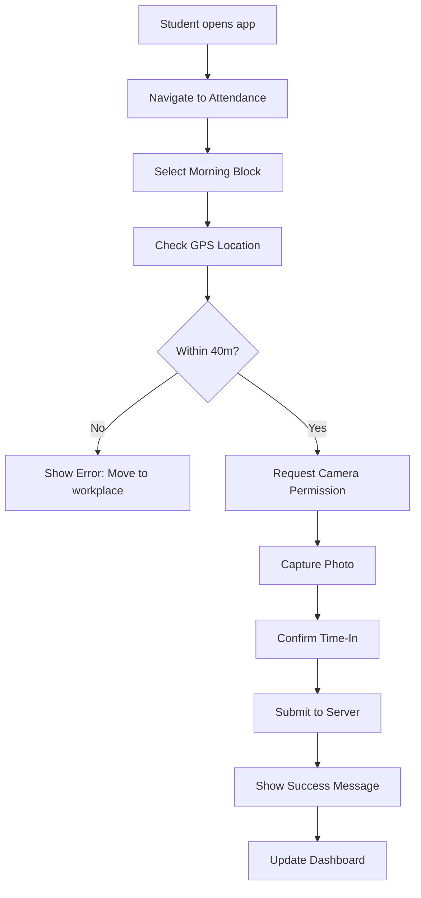
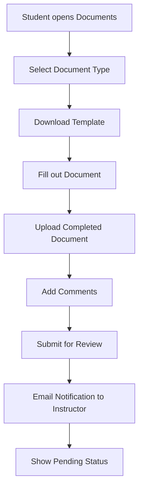
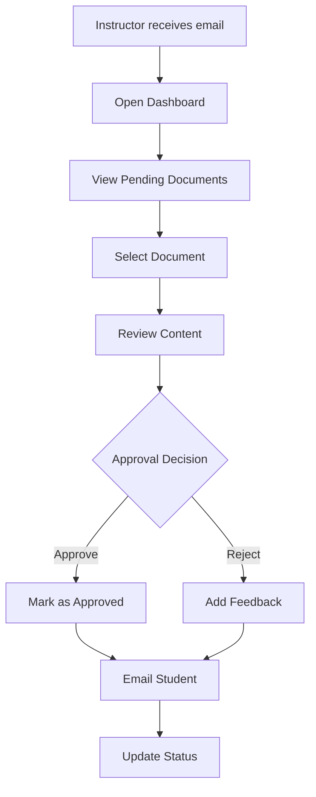

# OJT Route UX Design Document

**Version:** 1.0  
**Date:** October 5, 2025  
**Project:** OJT Route - Student OJT Tracking & Management System  
**UX Designer:** Sarah Chen  
**Team:** Pia Fernandez (Project Leader), Manuel A. Colorado (Developer), Kyla Rolan (Member)  
**Institution:** Carlos Hilado Memorial State University  

---

## Table of Contents

1. [Design Principles](#1-design-principles)
2. [Color Palette & Typography](#2-color-palette--typography)
3. [Component Library](#3-component-library)
4. [Mobile-First Wireframes](#4-mobile-first-wireframes)
5. [Responsive Breakpoints](#5-responsive-breakpoints)
6. [User Flow Diagrams](#6-user-flow-diagrams)
7. [Accessibility Guidelines](#7-accessibility-guidelines)
8. [Implementation Notes](#8-implementation-notes)

---

## 1. Design Principles

### 1.1 Core UX Principles

1. **Mobile-First Design** - Primary interface optimized for 360px-740px screens
2. **One-Handed Operation** - Critical actions (time-in/out) accessible with thumb
3. **Progressive Disclosure** - Show essential info first, details on demand
4. **Immediate Feedback** - Every action provides visual/audio confirmation
5. **Trust Through Transparency** - GPS accuracy, photo verification, timestamps visible
6. **Task-Oriented Navigation** - Clear paths to primary user goals
7. **Error Prevention** - Validate inputs before submission, clear error messages
8. **Consistent Patterns** - Same interaction patterns across all screens

### 1.2 CHMSU Brand Integration

- **Primary Green:** `#0ea539` (CHMSU official color)
- **Success/On Track:** `#10B981` (progress, approval)
- **Warning/Needs Attention:** `#F59E0B` (caution, pending)
- **Danger/At Risk:** `#EF4444` (urgency, rejection)
- **Neutral:** Gray scale for backgrounds and text
- **Typography:** Poppins font family (Google Fonts)

---

## 2. Color Palette & Typography

### 2.1 Color System

```css
:root {
  /* Primary Colors */
  --chmsu-green: #0ea539;
  --chmsu-green-light: #34d399;
  --chmsu-green-dark: #059669;
  
  /* Status Colors */
  --success: #10b981;
  --warning: #f59e0b;
  --danger: #ef4444;
  --info: #3b82f6;
  
  /* Neutral Colors */
  --gray-50: #f9fafb;
  --gray-100: #f3f4f6;
  --gray-200: #e5e7eb;
  --gray-300: #d1d5db;
  --gray-400: #9ca3af;
  --gray-500: #6b7280;
  --gray-600: #4b5563;
  --gray-700: #374151;
  --gray-800: #1f2937;
  --gray-900: #111827;
  
  /* Background Colors */
  --bg-primary: #ffffff;
  --bg-secondary: #f9fafb;
  --bg-tertiary: #f3f4f6;
}
```

### 2.2 Typography Scale

```css
/* Font Family */
font-family: 'Poppins', -apple-system, BlinkMacSystemFont, 'Segoe UI', sans-serif;

/* Font Sizes (Mobile-First) */
--text-xs: 0.75rem;    /* 12px */
--text-sm: 0.875rem;   /* 14px */
--text-base: 1rem;     /* 16px */
--text-lg: 1.125rem;   /* 18px */
--text-xl: 1.25rem;    /* 20px */
--text-2xl: 1.5rem;    /* 24px */
--text-3xl: 1.875rem;  /* 30px */
--text-4xl: 2.25rem;   /* 36px */

/* Font Weights */
--font-normal: 400;
--font-medium: 500;
--font-semibold: 600;
--font-bold: 700;
```

---

## 3. Component Library

### 3.1 Buttons

```html
<!-- Primary Action Button (Time In/Out) -->
<button class="btn btn-primary btn-lg btn-block">
  <i class="bi bi-clock"></i>
  Time In - Morning
</button>

<!-- Secondary Action Button -->
<button class="btn btn-outline-primary">
  <i class="bi bi-geo-alt"></i>
  Set Location
</button>

<!-- Danger Action Button -->
<button class="btn btn-danger">
  <i class="bi bi-x-circle"></i>
  Cancel
</button>

<!-- Floating Action Button (Mobile) -->
<button class="btn btn-primary btn-fab">
  <i class="bi bi-plus"></i>
</button>
```

### 3.2 Cards

```html
<!-- Progress Card -->
<div class="card progress-card">
  <div class="card-body">
    <div class="d-flex justify-content-between align-items-center mb-2">
      <h6 class="card-title mb-0">OJT Progress</h6>
      <span class="badge bg-success">On Track</span>
    </div>
    <div class="progress mb-2" style="height: 8px;">
      <div class="progress-bar bg-success" style="width: 65%"></div>
    </div>
    <small class="text-muted">390 / 600 hours completed</small>
  </div>
</div>

<!-- Status Card -->
<div class="card status-card">
  <div class="card-body">
    <div class="d-flex align-items-center">
      <div class="status-indicator bg-warning me-3"></div>
      <div>
        <h6 class="mb-1">Document Pending</h6>
        <small class="text-muted">Weekly Report #3</small>
      </div>
    </div>
  </div>
</div>
```

### 3.3 Forms

```html
<!-- Input with Icon -->
<div class="form-floating mb-3">
  <input type="text" class="form-control" id="schoolId" placeholder="School ID">
  <label for="schoolId">
    <i class="bi bi-person-badge me-2"></i>School ID
  </label>
</div>

<!-- File Upload -->
<div class="mb-3">
  <label for="document" class="form-label">Upload Document</label>
  <input type="file" class="form-control" id="document" accept=".pdf,.doc,.docx">
  <div class="form-text">PDF, DOC, DOCX files only. Max 10MB.</div>
</div>
```

### 3.4 Navigation

```html
<!-- Mobile Bottom Navigation -->
<nav class="navbar fixed-bottom navbar-light bg-white border-top">
  <div class="container-fluid">
    <a href="/student/dashboard" class="nav-link text-center">
      <i class="bi bi-house-door"></i>
      <small>Dashboard</small>
    </a>
    <a href="/student/attendance" class="nav-link text-center active">
      <i class="bi bi-clock"></i>
      <small>Attendance</small>
    </a>
    <a href="/student/documents" class="nav-link text-center">
      <i class="bi bi-file-text"></i>
      <small>Documents</small>
    </a>
    <a href="/student/messages" class="nav-link text-center">
      <i class="bi bi-chat"></i>
      <small>Messages</small>
    </a>
  </div>
</nav>
```

---

## 4. Mobile-First Wireframes

### 4.1 Login Page

```
┌─────────────────────────────────────┐
│  [☰]  OJT Route                     │
├─────────────────────────────────────┤
│                                     │
│        🎓 CHMSU Logo                 │
│                                     │
│  ┌─────────────────────────────────┐ │
│  │ School ID                       │ │
│  │ [________________]              │ │
│  └─────────────────────────────────┘ │
│                                     │
│  ┌─────────────────────────────────┐ │
│  │ Password                       │ │
│  │ [________________]              │ │
│  └─────────────────────────────────┘ │
│                                     │
│  ┌─────────────────────────────────┐ │
│  │        LOGIN                    │ │
│  └─────────────────────────────────┘ │
│                                     │
│  Forgot Password?                   │
│                                     │
└─────────────────────────────────────┘
```

**Key Features:**
- CHMSU branding with logo
- School ID + Password authentication
- Large touch-friendly input fields
- Clear call-to-action button
- Forgot password link (optional)

### 4.2 Student Dashboard

```
┌─────────────────────────────────────┐
│  [☰]  Welcome, John!        [🔔] [👤] │
├─────────────────────────────────────┤
│                                     │
│  ┌─────────────────────────────────┐ │
│  │ 📊 OJT Progress                  │ │
│  │ ████████████░░░░ 65%             │ │
│  │ 390 / 600 hours                  │ │
│  │ Status: On Track ✅              │ │
│  └─────────────────────────────────┘ │
│                                     │
│  ┌─────────────────────────────────┐ │
│  │ 📄 Documents (5/7)               │ │
│  │ ████████░░░░░░░ 71%             │ │
│  │ 2 pending approval              │ │
│  └─────────────────────────────────┘ │
│                                     │
│  ┌─────────────────────────────────┐ │
│  │ 📍 Today's Attendance           │ │
│  │ Morning: ✅ Time In 8:30 AM     │ │
│  │ Afternoon: ⏰ Time Out 5:00 PM  │ │
│  └─────────────────────────────────┘ │
│                                     │
│  ┌─────────────────────────────────┐ │
│  │ 💬 Recent Messages (2)           │ │
│  │ Instructor: "Good work today!"  │ │
│  │ System: "Document approved"    │ │
│  └─────────────────────────────────┘ │
│                                     │
│  [🏠] [⏰] [📄] [💬]              │
└─────────────────────────────────────┘
```

**Key Features:**
- Progress visualization with status indicators
- Quick access to critical information
- Bottom navigation for primary actions
- Real-time status updates
- Touch-friendly card layout

### 4.3 Attendance Page (Time-In Flow)

```
┌─────────────────────────────────────┐
│  [←]  Attendance            [📍] [📷] │
├─────────────────────────────────────┤
│                                     │
│  📍 Workplace Location              │
│  ABC Company - IT Department        │
│  📍 40m radius verified             │
│                                     │
│  ┌─────────────────────────────────┐ │
│  │ 🕘 Morning Block                │ │
│  │ ⏰ 8:00 AM - 12:00 PM           │ │
│  │                                 │ │
│  │ [✅ TIME IN] [⏸️ BREAK]         │ │
│  └─────────────────────────────────┘ │
│                                     │
│  ┌─────────────────────────────────┐ │
│  │ 🕐 Afternoon Block              │ │
│  │ ⏰ 1:00 PM - 5:00 PM           │ │
│  │                                 │ │
│  │ [⏰ TIME IN] [⏸️ BREAK]         │ │
│  └─────────────────────────────────┘ │
│                                     │
│  ┌─────────────────────────────────┐ │
│  │ 🌙 Overtime Block (Optional)   │ │
│  │ ⏰ 5:00 PM - 8:00 PM           │ │
│  │                                 │ │
│  │ [⏰ TIME IN] [⏸️ BREAK]         │ │
│  └─────────────────────────────────┘ │
│                                     │
│  📊 Today's Hours: 4.5 / 8.0       │
│                                     │
│  [🏠] [⏰] [📄] [💬]              │
└─────────────────────────────────────┘
```

**Key Features:**
- GPS location verification with accuracy indicator
- Block-based time tracking (Morning/Afternoon/Overtime)
- Large, accessible action buttons
- Real-time hour calculation
- Visual status indicators

### 4.4 Time-In Process (GPS + Photo)

```
┌─────────────────────────────────────┐
│  [←]  Time In - Morning             │
├─────────────────────────────────────┤
│                                     │
│  📍 Location Check                  │
│  ✅ Within 40m of workplace         │
│  📊 GPS Accuracy: 5m                │
│                                     │
│  ┌─────────────────────────────────┐ │
│  │ 📷 Take Photo                   │ │
│  │                                 │ │
│  │     [📷 Camera View]            │ │
│  │                                 │ │
│  │  [📷 Capture Photo]            │ │
│  └─────────────────────────────────┘ │
│                                     │
│  📝 Notes (Optional)                │
│  [________________________]        │
│                                     │
│  ┌─────────────────────────────────┐ │
│  │        CONFIRM TIME IN          │ │
│  └─────────────────────────────────┘ │
│                                     │
│  ⚠️ You must be at your workplace   │
│    to complete time-in              │
└─────────────────────────────────────┘
```

**Key Features:**
- Step-by-step verification process
- Camera integration with live preview
- GPS accuracy display
- Clear instructions and warnings
- Confirmation before submission

### 4.5 Workplace Location Setup

```
┌─────────────────────────────────────┐
│  [←]  Set Workplace Location        │
├─────────────────────────────────────┤
│                                     │
│  📍 Find Your Workplace             │
│                                     │
│  ┌─────────────────────────────────┐ │
│  │                                 │ │
│  │        [🗺️ Map View]           │ │
│  │                                 │ │
│  │     📍 Your Location            │ │
│  │     🏢 Workplace Pin            │ │
│  │                                 │ │
│  │  [📍 Use Current Location]     │ │
│  └─────────────────────────────────┘ │
│                                     │
│  🏢 ABC Company                     │
│  📍 IT Department, 2nd Floor       │
│  📏 Distance: 25m ✅                │
│                                     │
│  ┌─────────────────────────────────┐ │
│  │        SAVE LOCATION            │ │
│  └─────────────────────────────────┘ │
│                                     │
│  ⚠️ This location will be used for  │
│    all future attendance checks     │
└─────────────────────────────────────┘
```

**Key Features:**
- Interactive map with Leaflet.js
- Current location detection
- Workplace pin placement
- Distance verification
- One-time setup with confirmation

### 4.6 Document Submission

```
┌─────────────────────────────────────┐
│  [←]  Submit Document               │
├─────────────────────────────────────┤
│                                     │
│  📄 Weekly Report #3                │
│  📅 Due: Oct 10, 2025              │
│  📋 Template: Download              │
│                                     │
│  ┌─────────────────────────────────┐ │
│  │ 📎 Upload File                   │ │
│  │                                 │ │
│  │ [📁 Choose File]                │ │
│  │                                 │ │
│  │ No file selected                │ │
│  └─────────────────────────────────┘ │
│                                     │
│  📝 Comments (Optional)             │
│  [________________________]        │
│                                     │
│  ┌─────────────────────────────────┐ │
│  │        SUBMIT DOCUMENT          │ │
│  └─────────────────────────────────┘ │
│                                     │
│  📋 Requirements:                  │
│  • PDF, DOC, DOCX files only       │
│  • Maximum 10MB                    │
│  • Must be filled completely        │
└─────────────────────────────────────┘
```

**Key Features:**
- Clear document information
- File upload with validation
- Template download link
- Requirements checklist
- Optional comments field

### 4.7 Instructor Dashboard

```
┌─────────────────────────────────────┐
│  [☰]  Instructor Dashboard  [🔔] [👤] │
├─────────────────────────────────────┤
│                                     │
│  📊 Section Overview                │
│  BSIT-IS 3A (25 students)          │
│                                     │
│  ┌─────────────────────────────────┐ │
│  │ 📈 Student Status               │ │
│  │ 🟢 On Track: 18                │ │
│  │ 🟡 Needs Attention: 5           │ │
│  │ 🔴 At Risk: 2                   │ │
│  └─────────────────────────────────┘ │
│                                     │
│  ┌─────────────────────────────────┐ │
│  │ 📄 Pending Documents (8)        │ │
│  │ • John Doe - Weekly Report #2   │ │
│  │ • Jane Smith - OJT Plan         │ │
│  │ • Mike Johnson - Parental Consent│ │
│  │ [View All...]                   │ │
│  └─────────────────────────────────┘ │
│                                     │
│  ┌─────────────────────────────────┐ │
│  │ ⏰ Today's Attendance           │ │
│  │ Morning: 22/25 (88%)           │ │
│  │ Afternoon: 20/25 (80%)          │ │
│  └─────────────────────────────────┘ │
│                                     │
│  [📊] [📄] [⏰] [💬] [👥]         │
└─────────────────────────────────────┘
```

**Key Features:**
- Section overview with key metrics
- Student status distribution
- Pending documents queue
- Attendance summary
- Quick access to all features

### 4.8 Document Review (Instructor)

```
┌─────────────────────────────────────┐
│  [←]  Review Document               │
├─────────────────────────────────────┤
│                                     │
│  👤 John Doe (LJD12040300)         │
│  📄 Weekly Report #2               │
│  📅 Submitted: Oct 3, 2025         │
│                                     │
│  ┌─────────────────────────────────┐ │
│  │ 📎 Document Preview             │ │
│  │                                 │ │
│  │ [📄 Document Content]          │ │
│  │                                 │ │
│  │ [⬇️ Download Original]          │ │
│  └─────────────────────────────────┘ │
│                                     │
│  📝 Feedback                        │
│  [________________________]        │
│  [________________________]        │
│                                     │
│  ┌─────────────────────────────────┐ │
│  │ [✅ APPROVE] [❌ REJECT]         │ │
│  └─────────────────────────────────┘ │
│                                     │
│  📋 Review Checklist:              │
│  ☑️ Document is complete            │
│  ☑️ All required fields filled      │
│  ☐ Quality meets standards         │
└─────────────────────────────────────┘
```

**Key Features:**
- Student information header
- Document preview and download
- Feedback text area
- Clear approve/reject actions
- Review checklist

### 4.9 Admin Dashboard

```
┌─────────────────────────────────────┐
│  [☰]  Admin Dashboard        [🔔] [👤] │
├─────────────────────────────────────┤
│                                     │
│  📊 System Overview                 │
│                                     │
│  ┌─────────────────────────────────┐ │
│  │ 👥 Users                        │ │
│  │ Students: 150                  │ │
│  │ Instructors: 8                  │ │
│  │ Active Today: 45               │ │
│  └─────────────────────────────────┘ │
│                                     │
│  ┌─────────────────────────────────┐ │
│  │ 📈 Program Status               │ │
│  │ BSIT-IS: 75 students           │ │
│  │ BSIT-IT: 75 students           │ │
│  │ Completion Rate: 68%           │ │
│  └─────────────────────────────────┘ │
│                                     │
│  ┌─────────────────────────────────┐ │
│  │ ⚠️ Alerts (3)                   │ │
│  │ • 5 students at risk           │ │
│  │ • 12 documents overdue          │ │
│  │ • 2 failed email deliveries    │ │
│  └─────────────────────────────────┘ │
│                                     │
│  [👥] [📊] [📄] [⚙️] [📧]         │
└─────────────────────────────────────┘
```

**Key Features:**
- System-wide metrics
- Program status overview
- Alert notifications
- Quick access to management functions

---

## 5. Responsive Breakpoints

### 5.1 Mobile (360px - 740px)
- **Primary Interface** - Single column layout
- **Navigation** - Bottom tab bar
- **Buttons** - Full-width, large touch targets
- **Cards** - Stacked vertically
- **Forms** - Single column inputs

### 5.2 Tablet (768px - 1023px)
- **Navigation** - Sidebar with icons
- **Layout** - Two-column grid
- **Buttons** - Medium size, grouped
- **Cards** - Side-by-side layout
- **Forms** - Two-column inputs

### 5.3 Desktop (1024px+)
- **Navigation** - Full sidebar with labels
- **Layout** - Three-column grid
- **Buttons** - Standard size, inline
- **Cards** - Grid layout
- **Forms** - Multi-column inputs

---

## 6. User Flow Diagrams

### 6.1 Student Time-In Flow



### 6.2 Document Submission Flow



### 6.3 Instructor Review Flow



---

## 7. Accessibility Guidelines

### 7.1 Mobile Accessibility
- **Touch Targets** - Minimum 44px touch area
- **Color Contrast** - WCAG AA compliance (4.5:1 ratio)
- **Text Size** - Minimum 16px for body text
- **Focus Indicators** - Clear focus states for keyboard navigation

### 7.2 Visual Accessibility
- **Color Coding** - Not the only way to convey information
- **Icons** - Always paired with text labels
- **Status Indicators** - Use both color and shape/size
- **Loading States** - Clear progress indicators

### 7.3 Motor Accessibility
- **Large Buttons** - Easy to tap with thumb
- **Swipe Gestures** - Alternative to small buttons
- **Voice Input** - For notes and comments
- **Haptic Feedback** - Success/error vibrations

---

## 8. Implementation Notes

### 8.1 Bootstrap Customization

```css
/* Custom CSS Variables */
:root {
  --bs-primary: #0ea539;
  --bs-success: #10b981;
  --bs-warning: #f59e0b;
  --bs-danger: #ef4444;
  --bs-info: #3b82f6;
}

/* Custom Button Styles */
.btn-primary {
  background-color: var(--bs-primary);
  border-color: var(--bs-primary);
  font-weight: 600;
  padding: 0.75rem 1.5rem;
}

/* Mobile-First Card Styles */
.card {
  border: none;
  box-shadow: 0 2px 4px rgba(0,0,0,0.1);
  border-radius: 12px;
}

/* Progress Bar Customization */
.progress {
  height: 8px;
  border-radius: 4px;
  background-color: var(--bs-gray-200);
}
```

### 8.2 JavaScript Patterns

```javascript
// Mobile-First Touch Events
document.addEventListener('touchstart', function(e) {
  // Add touch feedback
  e.target.classList.add('touch-active');
});

// GPS Location Handling
function getCurrentLocation() {
  return new Promise((resolve, reject) => {
    if (!navigator.geolocation) {
      reject(new Error('Geolocation not supported'));
    }
    
    navigator.geolocation.getCurrentPosition(
      position => resolve(position),
      error => reject(error),
      {
        enableHighAccuracy: true,
        timeout: 10000,
        maximumAge: 300000
      }
    );
  });
}

// Camera Integration
async function capturePhoto() {
  try {
    const stream = await navigator.mediaDevices.getUserMedia({
      video: { facingMode: 'user' }
    });
    
    const video = document.getElementById('camera-preview');
    video.srcObject = stream;
    
    return new Promise(resolve => {
      const canvas = document.createElement('canvas');
      const context = canvas.getContext('2d');
      
      video.addEventListener('loadedmetadata', () => {
        canvas.width = video.videoWidth;
        canvas.height = video.videoHeight;
        context.drawImage(video, 0, 0);
        resolve(canvas.toDataURL('image/jpeg', 0.8));
      });
    });
  } catch (error) {
    throw new Error('Camera access denied');
  }
}
```

### 8.3 Responsive Utilities

```css
/* Mobile-First Media Queries */
@media (min-width: 768px) {
  .mobile-only { display: none; }
  .desktop-only { display: block; }
}

@media (max-width: 767px) {
  .mobile-only { display: block; }
  .desktop-only { display: none; }
}

/* Touch-Friendly Spacing */
.touch-target {
  min-height: 44px;
  min-width: 44px;
  padding: 12px;
}

/* Safe Area Insets for Notched Devices */
.safe-area-top {
  padding-top: env(safe-area-inset-top);
}

.safe-area-bottom {
  padding-bottom: env(safe-area-inset-bottom);
}
```

---

## 9. Design System Summary

### 9.1 Key Design Decisions

1. **Mobile-First Approach** - Primary interface optimized for 360px-740px screens
2. **CHMSU Brand Integration** - Official green color (#0ea539) with status color system
3. **Touch-Optimized Interface** - Large buttons, thumb-friendly navigation
4. **Progressive Disclosure** - Essential info first, details on demand
5. **Status-Driven Design** - Clear visual indicators for student progress and document status
6. **Accessibility-First** - WCAG AA compliance with multiple input methods

### 9.2 Component Reusability

- **Consistent Button Styles** - Primary, secondary, danger variants
- **Card-Based Layout** - Reusable card components for different content types
- **Status Indicators** - Standardized success, warning, danger states
- **Form Patterns** - Consistent input styling and validation
- **Navigation Components** - Mobile bottom nav, desktop sidebar

### 9.3 Performance Considerations

- **Optimized Images** - Compressed photos, lazy loading
- **Minimal JavaScript** - Vanilla JS, no heavy frameworks
- **CSS Optimization** - Custom properties, efficient selectors
- **Touch Performance** - Smooth animations, responsive feedback

---

## Conclusion

This UX design document provides a comprehensive foundation for implementing the OJT Route user interface. The mobile-first approach ensures excellent usability for students in the field, while the responsive design accommodates instructors and administrators on various devices.

**Key Success Factors:**
- **Intuitive Navigation** - Clear paths to primary actions
- **Trust-Building Design** - Transparent GPS and photo verification
- **Efficient Workflows** - Streamlined processes for common tasks
- **Accessible Interface** - Inclusive design for all users
- **CHMSU Branding** - Professional appearance with institutional identity

**Next Steps:**
1. Review wireframes with development team
2. Create high-fidelity mockups for key screens
3. Develop interactive prototypes for user testing
4. Implement responsive CSS framework
5. Begin frontend development with Bootstrap components

---

**END OF UX DESIGN DOCUMENT**
